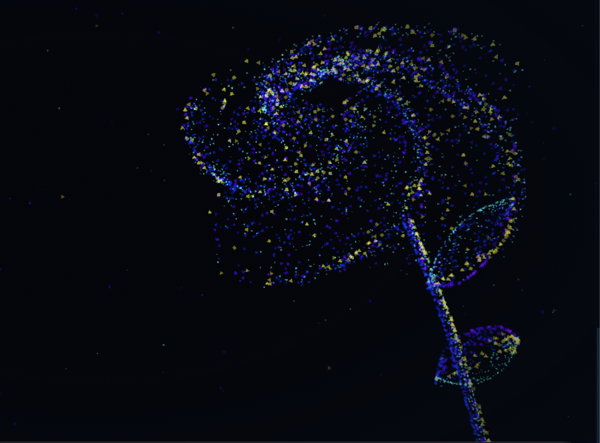

# Ege Deniz // Personal Hub

<p align="center">
  Spatial engineering portfolio for AI systems, full-stack product work, and cinematic web visuals.
</p>

<p align="center">
  <a href="https://rowy.engineer"><strong>rowy.engineer</strong></a>
</p>

<p align="center">
  
  
  
  
</p>

<p align="center">
  Dark interface. Glass UI. Shader-driven particle morphs. One continuous spatial surface.
</p>

<p align="center">
  
</p>

---

## Concept

This build treats the portfolio like an environment instead of a feed.

The structure is intentionally simple:

| Layer | Purpose |
| --- | --- |
| `Intro` | Establishes the main visual form and positioning |
| `Personal Hub` | Identity, media, tools, and surrounding context |
| `Studio Stack` | AI, engineering, and visual system summary |
| `Contact` | Outbound links and direct reachability |

## System

| Area | Stack |
| --- | --- |
| Framework | Next.js App Router, React, TypeScript |
| Styling | Tailwind CSS, custom glass and HUD styling |
| 3D | React Three Fiber, Three.js, `three-stdlib` |
| Motion | Framer Motion, pointer and scroll-linked uniforms |
| Visual Core | Instanced tetrahedron particle field with staged morph states |

## Key Files

| Path | Responsibility |
| --- | --- |
| `src/components/three/SpatialBackground.tsx` | Particle engine, shader, and morph behavior |
| `src/components/ui/Hero.tsx` | Landing section |
| `src/components/ui/BentoGrid.tsx` | Personal Hub layout |
| `src/components/ui/SystemArchitecture.tsx` | Studio Stack section |
| `src/components/ui/Navbar.tsx` | Section navigation |
| `src/components/hud/HUDOverlay.tsx` | HUD readouts and status layer |

## Notes

- The particle direction is still being art-directed, especially the hero silhouette and final-stage form.
- If `npm run build` is executed while `npm run dev` is still running, restart the dev server afterward so `.next` chunks do not go stale.

<details>
  <summary><strong>Run Locally</strong></summary>

```bash
git clone https://github.com/Ege-Deniz/personal-hub.git
cd personal-hub
npm install
npm run dev
```

Open `http://localhost:3000`.

</details>

<details>
  <summary><strong>Scripts</strong></summary>

```bash
npm run dev
npm run build
npm run start
```

</details>
